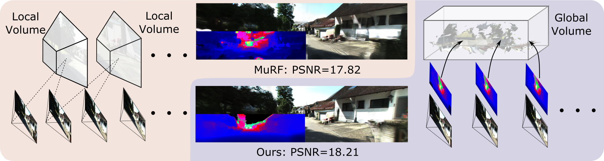

<h1 align="center">EDUS: Efficient Depth-Guided Urban View Synthesis (ECCV 2024)</h1>

[](https://arxiv.org/pdf/2407.12395)

Sheng Miao*, [Jiaxin Huang*](https://jaceyhuang.github.io/), Dongfeng Bai, Weichao Qiu, Bingbing Liu, [Andreas Geiger](https://www.cvlibs.net/) and [Yiyi Liao](https://yiyiliao.github.io/) 

Our project page can be seen [here](https://xdimlab.github.io/EDUS/).

## :book: Datasets
We evaluate our model on [KITTI-360](http://www.cvlibs.net/datasets/kitti-360/) and [Waymo](https://waymo.com/open/download/). Here we show the structure of a test dataset as follow. We provide the preprocessed data for inference on KITTI-360, which contains 5 validation scenes. We exploit the `Metric3d` for metric depth predictions and `HRNet` for sky mask segmentation.

You can download validation data directly from 🤗 [Hugging Face](https://huggingface.co/datasets/cookiemiao/EDUS_infer_dataset/tree/main). 

The dataset should have a structure as follows:
```
├── $PATH_TO_YOUR_DATASET
    ├── $SCENE_0
        ├── depth
        ├── semantic
        ├── mask
        ├── voxel
        ├── *.png
        ...
        ├── transfroms.json
    ...
    ├── SCENE_N
        ├── depth
        ├── semantic
        ├── mask
        ├── voxel
        ├── *.png
        ...
        ├── transfroms.json
```

## :house: Installation
Our EDUS is built on [nerfstudio](https://github.com/nerfstudio-project/nerfstudio). You can follow the nerfstudio webpage to install our code.  


#### Create environment
```bash
conda create --name EDUS -y python=3.8
conda activate EDUS
pip install --upgrade pip
```
#### Dependencies
Install PyTorch with CUDA (this repo has been tested with CUDA 11.8).
```bash
pip install torch==2.1.2+cu118 torchvision==0.16.2+cu118 --extra-index-url https://download.pytorch.org/whl/cu118
conda install -c "nvidia/label/cuda-11.8.0" cuda-toolkit
```
After pytorch, install [tiny-cuda-nn](https://github.com/NVlabs/tiny-cuda-nn):
```bash
pip install ninja git+https://github.com/NVlabs/tiny-cuda-nn/#subdirectory=bindings/torch
```
#### Installing EDUS
Install EDUS form source code
```bash
git clone https://github.com/XDimLab/EDUS.git
cd EDUS
pip install --upgrade pip setuptools
pip install -e .
```


<details>
<summary>Troubleshooting</summary>
<br>

- When installing the `inplace-abn` library, it does not check your CUDA version. If you encounter the following error while running:
```bash
libtorch_cuda_cu.so: cannot open shared object file: No such file or directory
```
Please reinstall `inplace-abn` to match with your CUDA version.
```bash
pip uninstall inplace-abn
rm -r ~/.cache/pip
pip install inplace-abn
```
</details>


## :chart_with_upwards_trend: Evaluation & Checkpoint
We provide the pretrained model trained on `KITTI-360` and `Waymo` and you can download the pre-trained models from  [here](https://huggingface.co/datasets/cookiemiao/EDUS_infer_dataset/tree/main). We recommend the checkpoint trained from `KITTI-360` to get better results.

Place the downloaded and put checkpoints in `checkpoint` folder in order to test it later.

### Feed-forward Inference
We provide the different sparsity levels (50%, 80%) to validate our methods, where a higher drop rate corresponds to a more sparsely populated set of reference images. Replace `$Data_Dir$` with your data path.
```
python scripts/infere_zeroshot.py edus
 --config_file config/test_GVS_nerf.yaml 
zeronpt-data 
--data $Data_Dir$ 
--drop50=True 
--include_depth_map=True
```
Replace the `--drop50=True` with `--drop80=True` to inference on `Drop80` setting.

## :clipboard: Citation

If our work is useful for your research, please give me a star and consider citing:

```
@inproceedings{miao2025efficient,
  title={Efficient Depth-Guided Urban View Synthesis},
  author={Miao, Sheng and Huang, Jiaxin and Bai, Dongfeng and Qiu, Weichao and Liu, Bingbing and Geiger, Andreas and Liao, Yiyi},
  booktitle={European Conference on Computer Vision},
  pages={90--107},
  year={2025},
  organization={Springer}
}
```
## :sparkles: Acknowledgement
- This project is based on [nerfstudio](https://github.com/nerfstudio-project/nerfstudio)
- Some codes are brought from [IBRNet](https://github.com/googleinterns/IBRNet) and [UrbanGIRAFFE](https://github.com/freemty/urbanGIRAFFE).